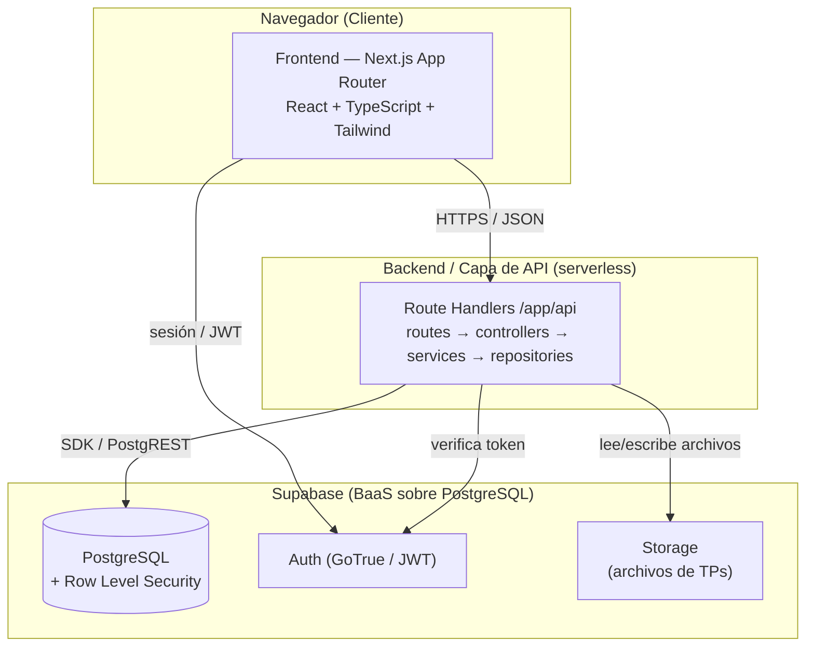

# SIGA — Sistema Integral de Gestión Académica

**Trabajo Final Grupal — Programación de Vanguardia**
Docente: Esteban Calcagno

> Sistema web con **frontend y backend desacoplados** para la gestión académica de una institución educativa. Stack principal: **Next.js (App Router)** en la capa de presentación y de API, y **Supabase** como capa de datos, autenticación y almacenamiento.

---

## 1. Descripción del Sistema

### Problema

La gestión académica en muchas instituciones está fragmentada entre planillas de cálculo, correos electrónicos, grupos de mensajería y trámites en papel. Esto genera información duplicada, inscripciones que se pierden, notas que se comunican de forma informal, entregas de trabajos prácticos sin trazabilidad y avisos que no llegan a todos los destinatarios. No existe una única fuente de verdad ni un control de quién puede ver o modificar cada dato.

### Solución propuesta

**SIGA** es una plataforma web que centraliza la operación académica en un solo lugar. Permite que estudiantes, docentes y administradores trabajen sobre la misma información actualizada, con control de acceso según el rol de cada usuario. El sistema cubre el ciclo completo: inscripción a materias, carga y consulta de notas, entrega y corrección de trabajos prácticos, gestión de calendarios y publicación de avisos.

### Usuarios y objetivos

| Rol | Qué puede hacer | Objetivo principal |
|-----|-----------------|--------------------|
| **Estudiante** | Inscribirse a materias, ver sus notas, entregar trabajos prácticos, consultar el calendario y leer avisos. | Tener visibilidad y control de su trayectoria académica. |
| **Docente** | Gestionar sus materias, cargar notas, crear y corregir trabajos prácticos, publicar eventos y avisos. | Operar la materia sin herramientas externas dispersas. |
| **Administrador** | Gestionar usuarios, materias, períodos académicos y permisos a nivel global. | Mantener la integridad y configuración del sistema. |

**Objetivos del sistema:**

- Centralizar la información académica en una única fuente de verdad.
- Automatizar notificaciones y avisos para reducir la comunicación informal.
- Garantizar trazabilidad de inscripciones, notas y entregas.
- Asegurar la confidencialidad de los datos mediante control de acceso por rol.

---

## 2. Arquitectura Propuesta

El sistema sigue una arquitectura **en capas con frontend y backend desacoplados**. El frontend nunca accede directamente a la base de datos: toda comunicación pasa por una capa de API que valida, autoriza y orquesta la lógica de negocio.



### Capas y componentes

1. **Capa de presentación (Frontend):** Next.js con App Router. Renderiza la interfaz, gestiona la sesión del usuario y consume la API por HTTPS. No contiene lógica de negocio sensible ni claves privadas.
2. **Capa de API / lógica de negocio (Backend):** Route Handlers de Next.js (`/app/api`) desplegados como funciones serverless. Reciben las peticiones, validan los datos, verifican permisos y orquestan los servicios. Es el único componente que usa la clave privilegiada de Supabase.
3. **Capa de datos y servicios (Supabase):** PostgreSQL como base de datos relacional, Auth para autenticación, Storage para los archivos de los trabajos prácticos, y Row Level Security (RLS) como segunda barrera de autorización a nivel de base de datos.

### Comunicación

- **Frontend → Backend:** peticiones HTTPS con cuerpo JSON. El token de sesión viaja en cada request para identificar al usuario.
- **Backend → Supabase:** el SDK de Supabase (o la API REST autogenerada por PostgREST) accede a PostgreSQL, Auth y Storage desde el servidor.
- **Realtime (opcional):** el frontend puede suscribirse a canales de Supabase Realtime para recibir avisos nuevos sin recargar.

### Justificación de las decisiones tecnológicas

- **Next.js (App Router):** unifica frontend y capa de API en un mismo proyecto con un único lenguaje (TypeScript), reduce la fricción de desarrollo en un equipo de 5–7 personas y ofrece despliegue inmediato en Vercel. Los Route Handlers permiten mantener el backend lógicamente separado del frontend (corren como funciones independientes del lado del servidor).
- **Supabase:** evita construir desde cero autenticación, base de datos y almacenamiento. Al estar sobre PostgreSQL, mantenemos un modelo relacional robusto con SQL real y migraciones versionadas, sin el lock-in de soluciones cerradas. RLS aporta seguridad a nivel de datos.
- **TypeScript de punta a punta:** tipado compartido entre frontend, API y modelos de datos, lo que reduce errores en integración.

---

## 3. Frontend

### Tecnología

- **Next.js (App Router)** con **React** y **TypeScript**.
- **Tailwind CSS** + **shadcn/ui** para los componentes de interfaz.
- **TanStack Query (React Query)** para el manejo de estado del servidor (caché, reintentos, sincronización).
- **Cliente de Supabase** únicamente para gestionar la sesión y suscripciones Realtime.

### Comunicación con el backend

El frontend se comunica con la capa de API mediante `fetch` envuelto en hooks de React Query. Cada petición incluye el token de sesión del usuario. La respuesta llega en JSON y React Query gestiona la caché y los estados de carga/error. La interfaz no consulta la base de datos directamente: siempre pasa por la API, lo que mantiene la separación de responsabilidades.

### Componentes principales y flujo de navegación

La aplicación usa **route groups** y layouts por rol. Tras iniciar sesión, cada usuario es redirigido a su panel correspondiente.

```
/login
/dashboard
  /estudiante
    /materias            → inscripción y materias inscriptas
    /notas               → calificaciones por materia
    /tps                 → trabajos prácticos y entregas
    /calendario          → eventos y fechas
    /avisos              → comunicados
  /docente
    /materias            → materias a cargo
    /materias/[id]/notas → carga de calificaciones
    /materias/[id]/tps   → creación y corrección de TPs
    /avisos              → publicación de comunicados
  /admin
    /usuarios            → ABM de usuarios
    /materias            → ABM de materias
    /periodos            → gestión de períodos académicos
```

Componentes reutilizables principales: `Sidebar` por rol, `DataTable` (listados de materias/notas/entregas), `FormDialog` (alta/edición), `FileUpload` (entrega de TPs hacia Supabase Storage) y `AvisoCard`.

---

## 4. Backend

El backend se implementa con **Route Handlers de Next.js** organizados en una **arquitectura en capas**, de modo que cada archivo de ruta sea delgado y delegue la lógica a controladores y servicios.

### Organización del proyecto

```
/app/api
  /materias/route.ts        → define rutas HTTP (GET, POST)
  /materias/[id]/route.ts
  ...
/src/server
  /controllers              → orquestan la petición/respuesta
  /services                 → lógica de negocio
  /repositories             → acceso a datos (Supabase)
  /schemas                  → validación con Zod (DTOs)
  /lib/supabase             → cliente del servidor (clave privilegiada)
```

**Flujo de una petición:** `Route Handler` (recibe la request) → `Controller` (valida con Zod, verifica el rol) → `Service` (aplica reglas de negocio) → `Repository` (lee/escribe en Supabase) → respuesta JSON.

### Endpoints principales

| Método | Endpoint | Descripción | Rol |
|--------|----------|-------------|-----|
| `GET` | `/api/materias` | Listar materias disponibles | Todos |
| `POST` | `/api/materias` | Crear materia | Docente / Admin |
| `POST` | `/api/materias/:id/inscripciones` | Inscribirse a una materia | Estudiante |
| `GET` | `/api/inscripciones` | Materias del estudiante | Estudiante |
| `POST` | `/api/notas` | Cargar una calificación | Docente |
| `GET` | `/api/inscripciones/:id/notas` | Ver notas de una inscripción | Estudiante / Docente |
| `POST` | `/api/materias/:id/tps` | Crear un trabajo práctico | Docente |
| `POST` | `/api/tps/:id/entregas` | Entregar un TP (archivo) | Estudiante |
| `GET` | `/api/tps/:id/entregas` | Ver entregas de un TP | Docente |
| `GET` | `/api/calendario` | Eventos del calendario | Todos |
| `POST` | `/api/avisos` | Publicar un aviso | Docente / Admin |
| `GET` | `/api/avisos` | Listar avisos | Todos |
| `GET/POST/PATCH/DELETE` | `/api/usuarios` | ABM de usuarios | Admin |

### Patrones y principios aplicados

- **Arquitectura en capas (layered):** rutas, controladores, servicios y repositorios con responsabilidades separadas.
- **Repository pattern:** aísla el acceso a Supabase; si cambiara la base de datos, solo se modifican los repositorios.
- **Validación con DTOs (Zod):** cada endpoint valida la forma de los datos de entrada antes de procesarlos.
- **Principios SOLID:** especialmente responsabilidad única (cada capa hace una cosa) e inversión de dependencias (los servicios dependen de abstracciones de repositorio).

### Modelo de datos (principales tablas)

`profiles` (usuario + rol), `materias`, `inscripciones`, `notas`, `trabajos_practicos`, `entregas`, `eventos_calendario`, `avisos`. Las relaciones se modelan con claves foráneas en PostgreSQL y se versionan con migraciones SQL gestionadas por el CLI de Supabase.

---

## 5. Testing

Se propone una estrategia de testing en tres niveles, priorizando la lógica de negocio y los flujos críticos.

| Tipo | Herramienta | Qué cubre |
|------|-------------|-----------|
| **Unitarios** | Vitest | Servicios y reglas de negocio (ej.: validar cupo de una materia antes de inscribir, cálculo de promedios). |
| **Integración** | Vitest + Supabase local (Docker) | Endpoints de la API contra una base de datos de prueba, verificando respuestas y permisos. |
| **End-to-end (E2E)** | Playwright | Flujos completos desde la interfaz: login, inscripción a una materia, entrega de un TP. |

### Justificación del enfoque

La mayor densidad de pruebas se concentra en los **tests unitarios de los servicios**, porque ahí reside la lógica de negocio y son los más rápidos y baratos de ejecutar (pirámide de testing). Los tests de **integración** validan que la API y la base de datos funcionen juntas, usando una instancia local de Supabase para no depender del entorno productivo. Los tests **E2E** cubren los caminos de mayor valor para el usuario y actúan como red de seguridad final. Todos se ejecutan automáticamente en el pipeline de CI antes de cada despliegue.

---

## 6. Despliegue y CI/CD

### Plataforma de hosting

- **Frontend + API (Next.js):** desplegados en **Vercel**, que ejecuta los Route Handlers como funciones serverless y genera **deployments de preview** automáticos por cada Pull Request.
- **Base de datos, Auth y Storage:** **Supabase Cloud** (instancia gestionada). Las migraciones de esquema se aplican con el **CLI de Supabase**.

### Automatización con GitHub Actions

El pipeline se dispara en cada push y Pull Request:

```yaml
# Resumen del workflow
on: [push, pull_request]
jobs:
  ci:
    steps:
      - checkout
      - install (npm ci)
      - lint (eslint)
      - type-check (tsc --noEmit)
      - test (vitest)            # unitarios + integración
      - build (next build)
  deploy:
    needs: ci
    if: branch == main
    steps:
      - aplicar migraciones (supabase db push)
      - deploy a Vercel (producción)
```

### Relación entre frontend y backend desplegados

Como ambos viven en el mismo proyecto Next.js, se despliegan juntos en Vercel: el frontend (assets estáticos y RSC) y la API (funciones serverless) quedan bajo el mismo dominio, lo que simplifica CORS y la gestión de sesiones. La capa de datos vive por separado en Supabase Cloud, y la API se conecta a ella mediante variables de entorno seguras. Cada Pull Request genera un entorno de preview con su propia URL para revisar cambios antes de pasar a producción.

---

## 7. Seguridad

### Autenticación

Se delega en **Supabase Auth (GoTrue)**, que emite **JWT** firmados al iniciar sesión. El frontend almacena la sesión y la envía en cada petición. Un **middleware** de Next.js protege las rutas privadas y redirige a `/login` a los usuarios no autenticados.

### Autorización

Doble barrera:

1. **A nivel de aplicación (RBAC):** cada controlador verifica el rol del usuario antes de ejecutar la acción (ej.: solo un docente puede cargar notas).
2. **A nivel de base de datos (Row Level Security):** PostgreSQL aplica políticas RLS que garantizan que, incluso ante un error en la API, un estudiante solo pueda leer sus propias notas y entregas. Es la defensa en profundidad.

### Validación de datos y manejo de errores

- **Validación de entrada con Zod** en cada endpoint: si los datos no cumplen el esquema, se responde `400` con un mensaje claro.
- **Manejo centralizado de errores:** los controladores capturan excepciones y devuelven códigos HTTP coherentes (`401` no autenticado, `403` sin permiso, `404` no encontrado, `500` error interno) sin filtrar detalles internos.

### Buenas prácticas generales

- Comunicación siempre por **HTTPS**.
- **Secretos en variables de entorno**; la clave privilegiada de Supabase (`service_role`) **solo se usa del lado del servidor**, nunca se expone al cliente.
- **Principio de mínimo privilegio** en las políticas RLS y en las claves.
- **Sanitización de archivos** subidos a Storage (tipo y tamaño) en la entrega de TPs.
- **Rate limiting** básico en endpoints sensibles como el login.

---

## 8. Presentación (guía para la exposición)

> Esta sección es una guía interna para preparar la presentación oral de 15 minutos. La rúbrica evalúa claridad, distribución del tiempo, participación grupal y recursos visuales.

### Distribución sugerida del tiempo (15 min)

| Bloque | Tiempo | Contenido |
|--------|--------|-----------|
| Introducción + problema/solución | 2 min | Secciones 1 |
| Arquitectura | 4 min | Diagrama y decisiones (sección de mayor puntaje) |
| Frontend + Backend | 4 min | Tecnologías, endpoints, organización |
| Testing + CI/CD + Seguridad | 3 min | Estrategia y pipeline |
| Demo / cierre | 2 min | Avances funcionales (si los hay) y conclusiones |

### Distribución de roles (equipo de 5–7)

- **Integrante 1:** problema, solución y usuarios.
- **Integrante 2:** arquitectura y decisiones tecnológicas.
- **Integrante 3:** frontend (componentes y navegación).
- **Integrante 4:** backend (endpoints y patrones).
- **Integrante 5:** testing, CI/CD y despliegue.
- **Integrante 6/7:** seguridad y demo / cierre.

### Recursos visuales recomendados

Diapositivas con el diagrama de arquitectura, el listado de endpoints en formato tabla y, si hay tiempo, una demo en vivo o capturas del deployment de preview en Vercel.

---

## Equipo de desarrollo

| Integrante | Rol | Función en el trabajo |
|------------|-----|------------------------|
| **Franco** | Team Leader / Full-Stack | Coordinó al equipo y definió la arquitectura general. Integró frontend, backend y Supabase, y configuró el despliegue y el pipeline de CI/CD. |
| **Iván** | Frontend | Desarrolló la interfaz con Next.js y Tailwind, y armó los layouts y la navegación por rol (estudiante, docente, admin). |
| **Sergio** | Frontend | Implementó los componentes reutilizables y la comunicación con la API mediante React Query, incluida la carga de archivos de TPs. |
| **Vanesa** | Backend | Diseñó el modelo de datos y los endpoints de la API, y organizó la capa de servicios y repositorios sobre Supabase. |
| **Armando** | Backend | Implementó la autenticación, la autorización por rol (RBAC + RLS) y la validación de datos con Zod. |
test
